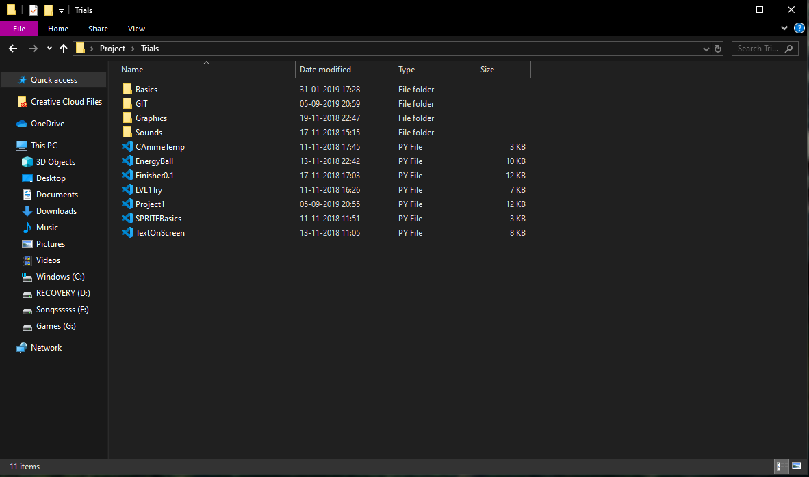

This was my first project on python.

The code is pretty basic and doesn't use any advanced "pygame" functions, only the basic ones.

1. To **run the game** you will have to extract all the given files in one directory like shown below.

 

Now the code is self explanatory and I've put comments wherever it was necessary.

2. Only thing that I think is worth explaining is the **"FPS" variable**.

This thing particularly increases the number of times the screen is refreshed per second, or in simple terms the speed of the game.

3. Next thing worth mentioning is this part, 

Though I've tried to keep it as simple as possible, in a nutshell these particular set of lines is used to get the **location of various** files that are required to load before the game starts.

This is the particular reason for extracting the files in the same folder and not in different ones.

### SCREENSHOTS FROM THE GAME

1. This is the **menu** of the game:

2. This is an **In-Game** shot:
    
    (i) The blue bar is the shield.
    
    (ii) The green bar is the health.
    
    
### Warning
The game crashes upon you losing your health, I didn't get the time to work on that, but I'll try to do so as soon as I get the time.

### Any Changes 
If you wish to make any changes to this game feel free to do so, just don't forget to credit me for the part I've done, not only me, but with all the projects you pick up from github.

Thanks for using this repository! 

# :D
